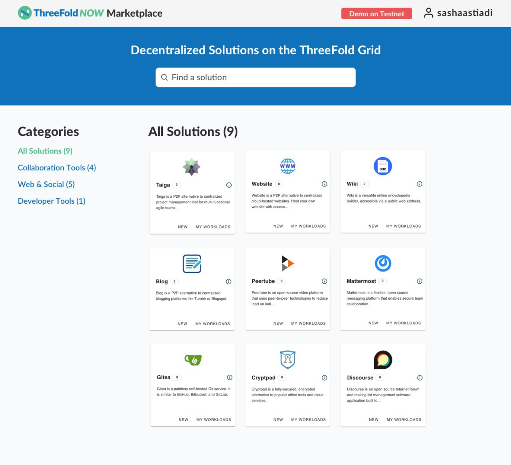

# What Is ThreeFold Now?

**ThreeFold has created the largest active peer-to-peer cloud on the planet — but the Internet is more than just storage and capacity. The cloud is only the engine for the Internet. To fully realize the vision of an Internet built for everyone, by everyone, we need easy-to-use and easy-to-deploy alternatives to the online tools and applications we use most.**

Today, ThreeFold Now provides ready-made decentralized solutions that are available for communities seeking alternatives to centralized solutions. This makes it possible for online communities to actually own their communities – the tools they use and the data they put there – rather than relying on centralized entities where they essentially rent the space and give away their data.

The applications on ThreeFold Now can be deployed (launched or created) in a matter of minutes. Some of the first apps on the marketplace include office and collaboration tools, a project management solution, forum, video hosting, and video conferencing. More solutions will be added in the future.

**The Internet of tomorrow, available today — this is [ThreeFold Now](https://marketplace.threefold.io).**  

# Current Status

Please note that the ThreeFold Now Marketplace is currently operating in demo mode on testnet. This means your deployments will be cancelled after three hours automatically. We are working to get some of the first solutions live on mainnet by December.

The tools still require some technical know-how, but:

1. We have tutorials tied to each live solution
2. We are very happy with progress until today
3. We firmly believe there is nothing else out there like ThreeFold Now